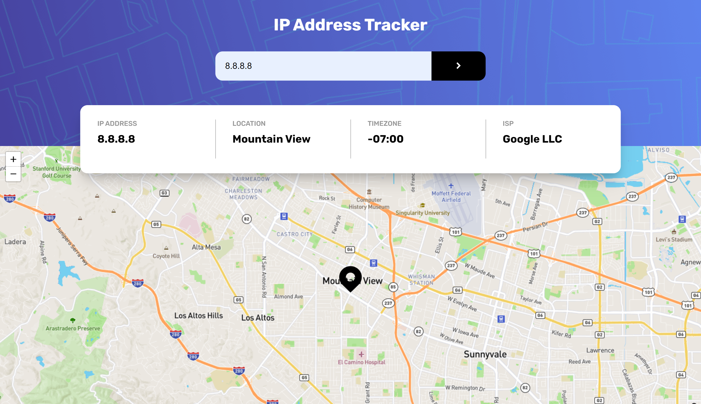
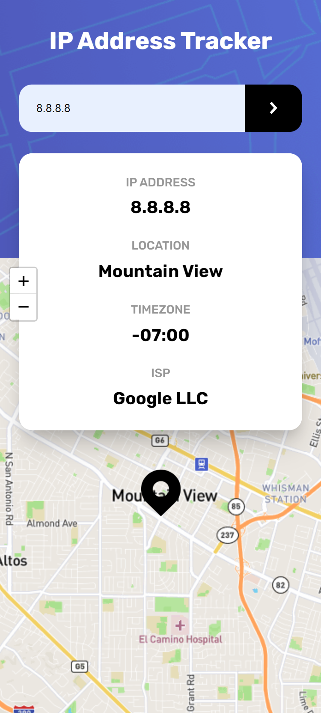

<h1 align="center">IP Address Tracker - Frontend Mentor solution</h1>

Enter an IP address from anywhere in the world and see an interactive map corresponding to its location. Need an example address? Try 8.8.8.8 or 17.0.0.0 for two famous tech companies.

## Links 🌟

- Live site: [Try it out here 💻](https://thethomasy.github.io/IP-Address-Tracker/ 'Live View')
- This is a solution to the [IP address tracker challenge on Frontend Mentor](https://www.frontendmentor.io/challenges/ip-address-tracker-I8-0yYAH0).

## Screenshots 📷

  
<!--    -->

## Built With 🛠

- HTML
- [Sass](https://sass-lang.com/)
- JavaScript
- [IP Geolocation API](https://geo.ipify.org/)
- [Leaflet JS](https://leafletjs.com/)

## Future Updates 🎁

- [ ] Add animation when changing map locations - this is supported by Leaflet JS.
- [ ] Fix overlapping map controls in mobile
- [ ] Show user's own IP address on initial load

## Author 🧑

**Tom Young**

- [Github Profile 👨‍💻](https://github.com/TheThomasY)
- [Email ✉](mailto:tomyoungdev@gmail.com?subject=Hi 'Hi!')
- [LinkedIn 💼](https://www.linkedin.com/in/tom-young5555/)
- [Dev.to 🖊](https://dev.to/thetomy)

Give a ⭐️ if you like this project!
